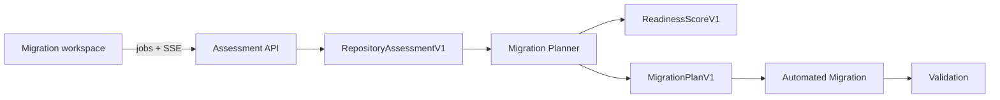

# ARM Migration Assist

An evidence-first engineering workspace for accelerating Windows on Arm
application readiness and migration.

A developer provides a GitHub repository URL and gets a commit-pinned readiness
assessment, an auditable migration strategy, approval-gated work items,
portable reports, and a contract ready for reviewable patch generation.

- [Architecture](docs/ARCHITECTURE.md)
- [Deployment and CI/CD](docs/CICD.md)
- [Frontend workspace](frontend/README.md)

## Tech stack (from the spec)

| Area | Choice |
|------|--------|
| Frontend | React + Fluent UI |
| Backend | .NET API |
| AI | Azure OpenAI or approved internal endpoint (optional Phi) |
| Code analysis | Tree-sitter, Roslyn, Clang, project-file parsers |
| Repository access | Read-only GitHub REST commit archive or existing local worktree |
| Output | Unified dashboard, JSON contracts, Markdown/HTML reports, reviewable patches |

## Architecture



The React and Fluent UI application is the single entrypoint. Assessment and
planning run as independent .NET Container Apps; the frontend runs in Azure
Static Web Apps. Versioned JSON contracts keep every module independently
testable and deployable. See [the architecture guide](docs/ARCHITECTURE.md) for
runtime sequences, security boundaries, and module internals.

## Project structure

The folders map directly to the four features in the spec, so anyone reading the
spec can find where their code goes. Each feature folder holds the user stories
under it.

```text
arm-migration-assist/
├── frontend/                  # React + Fluent UI dashboard
│
├── backend/                   # .NET API
│   ├── Assessment/            # Feature 1: Repository Analysis
│   │   ├── RepositoryDiscovery/     # Story 1.1 / 1.2
│   │   ├── DependencyScanner/       # Story 1.3
│   │   └── CodeCompatibility/       # Story 1.4
│   │
│   ├── MigrationPlanner/      # Feature 2: AI Migration Planner
│   │   ├── ReadinessScoring/        # Story 2.1
│   │   ├── StrategyGenerator/       # Story 2.2
│   │   └── ReportGeneration/        # Story 2.3
│   │
│   ├── AutomatedMigration/    # Feature 3: Automated Migration Actions
│   │   ├── BuildConfiguration/      # Story 3.1
│   │   ├── PipelineUpdates/         # Story 3.2
│   │   └── CodeMigration/           # Story 3.3
│   │
│   └── Validation/            # Feature 4: Validation and Demo
│       ├── BuildValidation/         # Story 4.1
│       └── Dashboard/               # Story 4.2 (backend support)
│
└── samples/                   # Reference repos for the demo (Story 4.3)
    ├── comfyui/
    └── open-webui/
```

## How the folders map to the spec

| Spec | Folder |
|------|--------|
| Feature 1: Repository Analysis | `backend/Assessment/` |
| Feature 2: AI Migration Planner | `backend/MigrationPlanner/` |
| Feature 3: Automated Migration Actions | `backend/AutomatedMigration/` |
| Feature 4: Validation & Demo | `backend/Validation/` + `samples/` |
| Frontend dashboard | `frontend/` |
| Reference repos (ComfyUI, Open WebUI) | `samples/` |

Each backend module owns its implementation and publishes a contract for the next
stage. Infrastructure and workflows are separated from product code so releases
cannot accidentally replace another service.

## Workflow

The product follows the six stages in the spec:

| Stage | What happens | Folder |
|-------|--------------|--------|
| 1. Connect | Provide a credential-free GitHub URL | `frontend/` |
| 2. Assess | Stream technology, dependency, build, and code evidence | `backend/Assessment/` |
| 3. Plan | Score readiness and automatically produce a validated strategy | `backend/MigrationPlanner/` |
| 4. Transform | Hand approved work to review-only patch generators | `backend/AutomatedMigration/` |
| 5. Validate | Execute plan acceptance checks on approved changes | `backend/Validation/` |
| 6. Deliver | Export assessment, plan, Markdown, HTML, and patch artifacts | `frontend/` + backend modules |

Keep the boundaries simple: assessment produces facts with file evidence, the planner
scores and recommends, automated migration produces reviewable patches, and validation
records measured build/test outcomes.

## Run locally

Start the assessment API, planner API, and frontend in separate terminals:

```pwsh
dotnet run --project backend/Assessment/RepositoryDiscovery/RepositoryDiscovery.csproj -- serve
dotnet run --project backend/MigrationPlanner/src/MigrationPlanner.Api/MigrationPlanner.Api.csproj
Set-Location frontend; npm install; npm run dev
```

Open `http://127.0.0.1:5173`, enter a GitHub repository URL, and keep the page
open while live assessment events and the automatic migration plan arrive.

The approval-gated validation CLI, asynchronous API, deterministic evidence
engine, and optional Foundry-assisted diagnosis are documented in
[backend/Validation/README.md](backend/Validation/README.md).
