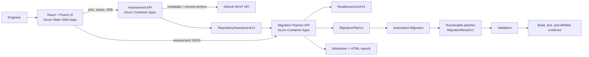

# ARM Migration Assist architecture

ARM Migration Assist is one controlled engineering workflow: connect a GitHub
repository, collect reproducible evidence, choose an ARM64 migration strategy,
prepare reviewable changes, and validate the approved result.

## Design principles

- **Read-only first.** Remote intake downloads an immutable GitHub commit archive.
  Repository code, hooks, build scripts, and installers are never executed during
  assessment.
- **Contracts between modules.** Each stage publishes a versioned JSON artifact;
  downstream stages do not reach into upstream implementation details.
- **Evidence before inference.** Assessment facts carry stable evidence IDs.
  Scores, recommendations, work items, risks, and acceptance checks retain those
  references.
- **Deterministic control plane.** Readiness scoring, schema validation, evidence
  validation, safety checks, and report rendering remain deterministic even when
  an AI model proposes the strategy.
- **Human approval before change.** Planning can prepare Feature 3 work, but every
  work item is approval-gated and generated patches are review-only.

## System context



The frontend and two APIs deploy independently. This prevents a planner release
from replacing assessment resources and lets the Static Web App call each
Container App through an explicit HTTPS origin.

## End-to-end runtime

```mermaid
sequenceDiagram
    actor Engineer
    participant UI as Migration workspace
    participant A as Assessment API
    participant G as GitHub REST
    participant P as Planner API
    participant T as Feature 3
    participant V as Validation

    Engineer->>UI: Enter GitHub repository URL
    UI->>A: POST /api/assessment-jobs
    A->>G: Resolve default branch and immutable commit
    G-->>A: Metadata and commit archive
    A-->>UI: SSE phase, percent, message
    A->>A: Catalog once; run independent scanners in parallel
    UI->>A: GET completed RepositoryAssessmentV1
    UI->>P: POST /api/migration-plans (unchanged assessment)
    P->>P: Validate, score, plan, and safety-check
    P-->>UI: Run ID, MigrationPlanV1, ReadinessScoreV1
    UI->>P: GET report.md or report.html
    UI-->>Engineer: Evidence, strategy, gates, and acceptance checks
    Engineer->>T: Approve and provide exported MigrationPlanV1
    T-->>Engineer: Reviewable patch files only
    Engineer->>V: Validate approved changes on ARM64
```

## Module architecture

### Frontend migration workspace

Path: `frontend/`

The React application is the single user entrypoint. It owns orchestration, not
scoring or repository analysis:

1. Creates a bounded assessment job.
2. Consumes ordered SSE progress, with status polling as a fallback.
3. Retrieves the completed assessment and submits it unchanged to the planner.
4. Presents readiness, recommendation, evidence, work items, missing skills,
   approval gates, and validation checks in one printable report.
5. Exports assessment JSON, `MigrationPlanV1`, Markdown, and self-contained HTML.

The workflow rail reports actual state for Connect, Assess, Plan, Transform, and
Validate. A stage is never shown as complete merely for presentation.

### Assessment

Path: `backend/Assessment/`

`RepositoryDiscoveryService` coordinates intake and four scanner surfaces:

- repository and technology discovery;
- dependency manifest and native-binary inspection;
- architecture-sensitive code analysis;
- build, CI, packaging, and Windows experience signals.

Remote intake resolves the default branch to a commit SHA, downloads the pinned
ZIP archive, safely extracts bounded regular files, catalogs content once, and
deletes the temporary workspace after use. Technology, dependency, and code
scanners then run concurrently over the immutable catalog. The service validates
cross-record evidence before publishing `RepositoryAssessmentV1`.

The HTTP host supports synchronous calls for simple clients and queued jobs for
the product UI. Queue size, execution concurrency, result retention, archive
sizes, file counts, individual file reads, and total cached text are bounded.

### Migration Planner

Path: `backend/MigrationPlanner/`

The planner accepts only schema-valid `RepositoryAssessmentV1` input. Its
pipeline is:

1. validate schema, coverage, and evidence references;
2. calculate the five-dimension deterministic readiness score;
3. build a grounded prompt from assessment facts and the versioned guidance
   corpus;
4. invoke the configured Fake, Phi, or Hosted provider;
5. validate plan shape, evidence and guidance citations, skills, dependency
   ordering, score digest, recommendation consistency, and safety rules;
6. retain successful runs in a bounded artifact store and render reports without
   another model call.

The model cannot change the deterministic score. Unsupported execution
capabilities are explicit `missingSkills`; they are not mislabeled as available
Feature 3 generators.

### Automated Migration

Path: `backend/AutomatedMigration/`

Feature 3 binds directly to the subset of `MigrationPlanV1` it needs. The
production selector recognizes three skills:

- `build-config-generator` for supported Docker, .NET, and Visual C++ targets;
- `ci-pipeline-generator` for GitHub Actions and Azure Pipelines;
- `code-transformer` for model-assisted, single-file compatibility patches.

Generators read a caller-provided local worktree and write unified diffs plus
`migration-result.json` to a separate output directory. They do not apply the
patches. Publishing is a separate, explicit opt-in path.

### Validation

Path: `backend/Validation/`

The validation boundary consumes Feature 3's generated-change artifact and each
work item's acceptance tests. It is responsible for building and testing the
approved change on ARM64, comparing functional and performance behavior with the
baseline, and linking failures back to plan and assessment evidence IDs. The
current repository defines this contract and demo surface; additional execution
adapters can be added without changing assessment or planning contracts.

## Contract chain

| Producer | Contract | Consumer | Invariant |
| --- | --- | --- | --- |
| Assessment | `RepositoryAssessmentV1` | Planner | Commit-pinned facts and resolvable evidence IDs |
| Scorer | `ReadinessScoreV1` | Planner and reports | Deterministic five-dimension score with digest |
| Planner | `MigrationPlanV1` | UI and Automated Migration | Approval-gated, evidence-linked, schema-valid work |
| Automated Migration | `migration-result.json` | Validation | Patch paths, acceptance checks, and evidence linkage |

Schemas live in `backend/MigrationPlanner/contracts/`. The assessment schema is
also embedded in the assessment API and exposed at
`GET /api/contracts/repository-assessment/v1`.

## Security and privacy boundaries

- URL intake accepts credential-free `https://github.com/{owner}/{repository}`
  values only.
- Archive extraction rejects rooted paths, traversal, symbolic links, duplicate
  entries, and configured size limits.
- Anonymous cloud assessment never reads ambient Git credentials.
- Protected-repository sign-in uses Git Credential Manager and is loopback-only;
  the cloud UI does not expose local credentials.
- API responses containing jobs, auth state, or reports use no-store semantics.
- The planner allowlists tools and rejects unknown evidence, unknown undeclared
  skills, unsafe instructions, and score tampering.
- Feature 3 output is a review artifact; repository mutation and publication are
  separate explicit actions.

## Deployment topology

The target Azure resource group contains:

- one Static Web App for `frontend/dist`;
- one Container App for the assessment API;
- one Container App for the planner API;
- Azure Container Registry, Container Apps environment, logging, managed
  identity, and the configured model endpoint.

Deployment workflows are intentionally independent:

- `.github/workflows/assessment-cd.yml`
- `.github/workflows/cd.yml`
- `.github/workflows/frontend-static-web-app.yml`
- `.github/workflows/infra.yml`

See [CI/CD](CICD.md) for OIDC, variables, CORS origins, and rollout commands.